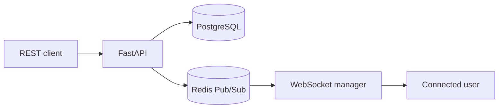

# Real-Time Notification Service

A portfolio-ready notification backend built with FastAPI, WebSockets, Redis Pub/Sub, JWT authentication, SQLAlchemy, and PostgreSQL support.

## Features

- User registration and JWT login
- Authenticated WebSocket connections
- Instant per-user notification delivery
- Redis Pub/Sub for multiple API instances
- Persistent notification history
- Read, unread, and read-all operations
- Notification type filtering and pagination
- Custom JSON metadata in notifications
- SQLite for simple local development
- PostgreSQL, Redis, and API Docker Compose stack
- Interactive Swagger documentation
- Automated API and WebSocket tests

## Architecture



When Redis is disabled, the service delivers events through its in-memory WebSocket manager. Enable Redis when running multiple application instances.

## Project structure

```text
realtime-notification-service/
├── app/
│   ├── api/routes/       # Auth, notifications, and WebSocket routes
│   ├── core/             # Configuration and JWT security
│   ├── db/               # SQLAlchemy database setup
│   ├── models/           # User and notification models
│   ├── realtime/         # Connection manager and Redis broker
│   ├── schemas/          # Pydantic validation models
│   └── main.py
├── tests/
├── .env.example
├── Dockerfile
├── docker-compose.yml
└── requirements.txt
```

## Local setup

### 1. Create and activate a virtual environment

Windows PowerShell:

```powershell
python -m venv .venv
.venv\Scripts\Activate.ps1
```

macOS/Linux:

```bash
python3 -m venv .venv
source .venv/bin/activate
```

### 2. Install packages

```bash
pip install -r requirements.txt
```

### 3. Configure the application

Copy `.env.example` to `.env`. Generate a secure secret:

```bash
python -c "import secrets; print(secrets.token_urlsafe(32))"
```

Use the generated value as `SECRET_KEY`.

### 4. Start the server

```bash
uvicorn app.main:app --reload
```

Open http://127.0.0.1:8000/docs for Swagger UI.

## API routes

| Method | Endpoint | Description |
|---|---|---|
| POST | `/api/v1/auth/register` | Create a user account |
| POST | `/api/v1/auth/login` | Receive a JWT access token |
| GET | `/api/v1/auth/me` | View the authenticated user |
| POST | `/api/v1/notifications` | Create and immediately publish a notification |
| GET | `/api/v1/notifications` | List the user's notifications |
| PATCH | `/api/v1/notifications/{id}/read` | Mark one notification as read |
| PATCH | `/api/v1/notifications/read-all` | Mark all notifications as read |
| DELETE | `/api/v1/notifications/{id}` | Delete a notification |
| WS | `/ws/notifications?token=JWT` | Receive real-time events |

## WebSocket example

Replace `YOUR_JWT_TOKEN` with the token returned from the login endpoint.

```javascript
const socket = new WebSocket(
  "ws://localhost:8000/ws/notifications?token=YOUR_JWT_TOKEN"
);

socket.onmessage = (event) => {
  const payload = JSON.parse(event.data);
  console.log("Notification event:", payload);
};
```

New notifications arrive in this shape:

```json
{
  "event": "notification.created",
  "notification": {
    "id": 1,
    "recipient_id": 2,
    "title": "Order shipped",
    "message": "Your order is on the way.",
    "type": "success",
    "data": {"order_id": 4821},
    "is_read": false
  }
}
```

## Run the tests

```bash
pytest
```

## Docker setup

Start FastAPI, PostgreSQL, and Redis together:

```bash
docker compose up --build
```

Then open http://localhost:8000/docs.

> The Compose credentials are only for local development. Use managed secrets and strong credentials in production.

## Future improvements

- Role-based permission for notification producers
- Email, SMS, and push notification channels
- Background workers with Celery
- Delivery receipts and retry policies
- Rate limiting
- Alembic migrations
- GitHub Actions CI/CD

## License

MIT License
